#  AriadneNavMesh
This is a personal project aiming to implement the first steps of navmesh generation (geometry input, triangle voxelization and walkable filtering) in Unity. My main reference is [Recast Navigation](https://github.com/recastnavigation/recastnavigation).

## Geometry input

Started with a GeometryGetter class to see how I could retrieve scene geometry in Unity. I used the mesh filter component, so for now it takes only render meshes into account (might add option for physics colliders later).

## Triangle voxelization

### Heightfield

THE key element of navmesh generation is the heightfield. The heightfield is by a bounding box, and its floor is a X-Z grid. Its first use is to voxelize triangles and get their spans (y-extent across a cell of the X-Z grid). I started with a centered grid, but I later moved-on to a grid starting at the bounding box minimun X and Z, for more convenient coordinates.

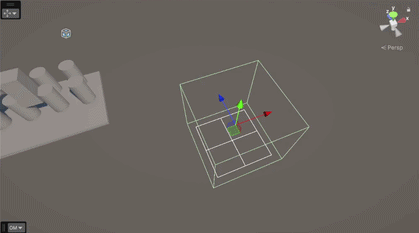

### Mapping

I then worked on mapping a single triangle to the heightfield's grid. It was pretty straightforward: we take the triangle's bounding box and map its X and Z coordinates to the grid's cells.

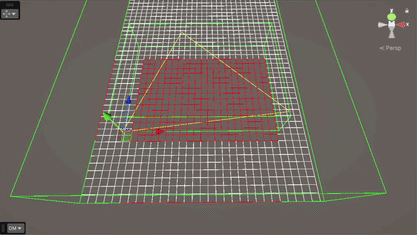

### Clipping
I then worked on clipping the polygon to each cell of the grid using Sutherland-Hodgman clipping algorithm. We start by clipping the polygon by an axis. We iterate over each segments of the polygon and compare them to a side of the current cell (our axis):
- if both points are inside of the cell, we save them both to the new polygon
- if both points are outside, we save neither
- if one of the point is inside and the other outsie, we save the one inside and we save the intersection point between the cell's side and the current segment.

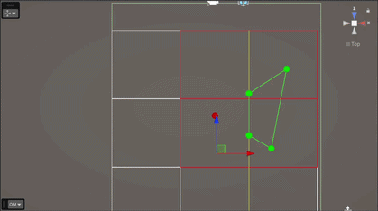

Once this is done, we repeat the operation for the 3 other sides of the cell, and we obtain the new polygon clipped to the cell. (here the triangle is clipped according to the bottom-leftmost cell)

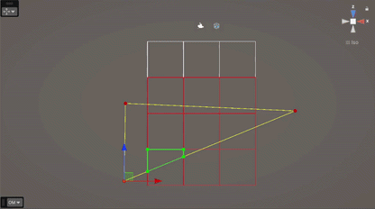

We then repeat the operation for every cell the triangle was mapped to.

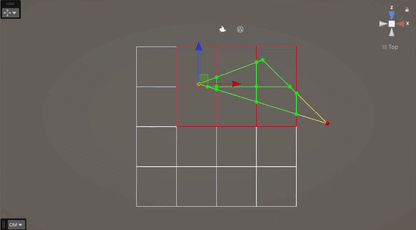
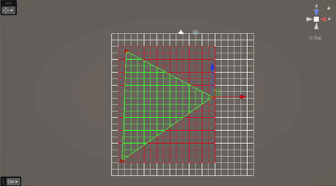

### Spans

Once we have a polygon for each cell, we get its lowest and highest points to register them as a span (Y-extent) in the heightfield.

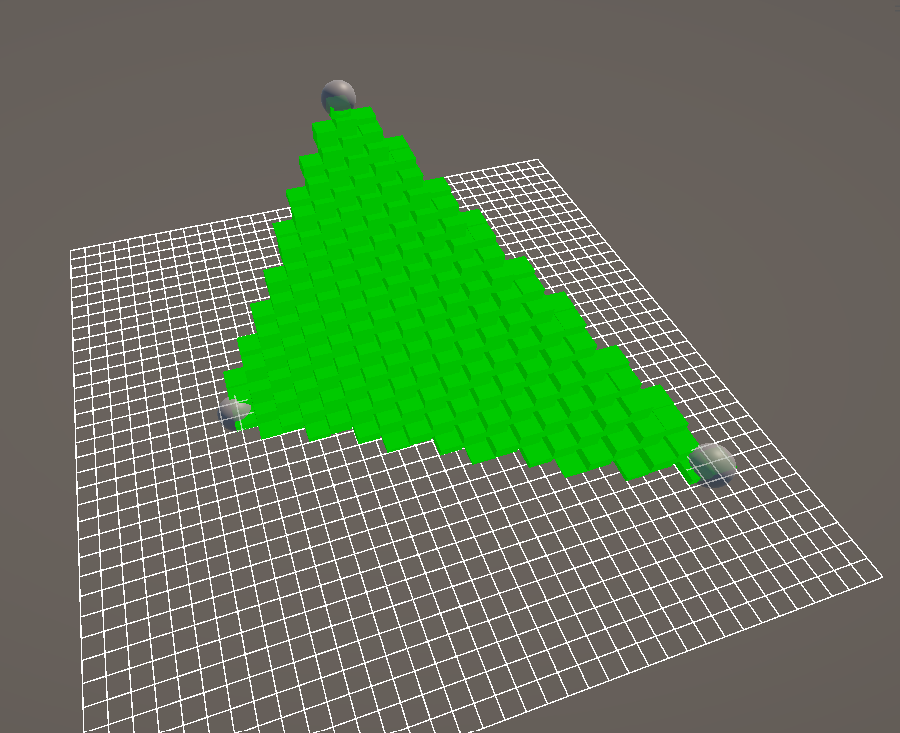

Once the pipeline working for one triangle, I fed the geometry getter's triangles to the heightfield, which led to whole meshes rasterization.

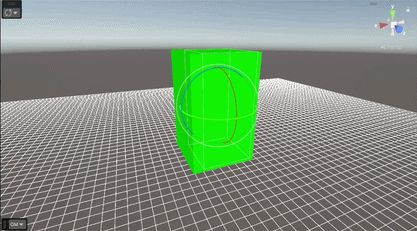

I then had to add proper spans management with multiple spans and spans merging, to be able to have clear spans between different objects. Without this logic:

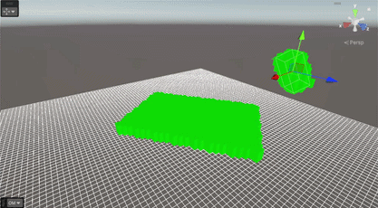

Once I implemented this, I experimented with different grid resolutions.

| Cell size | Result |
| :---: | :---: |
| With cell size of 1 | 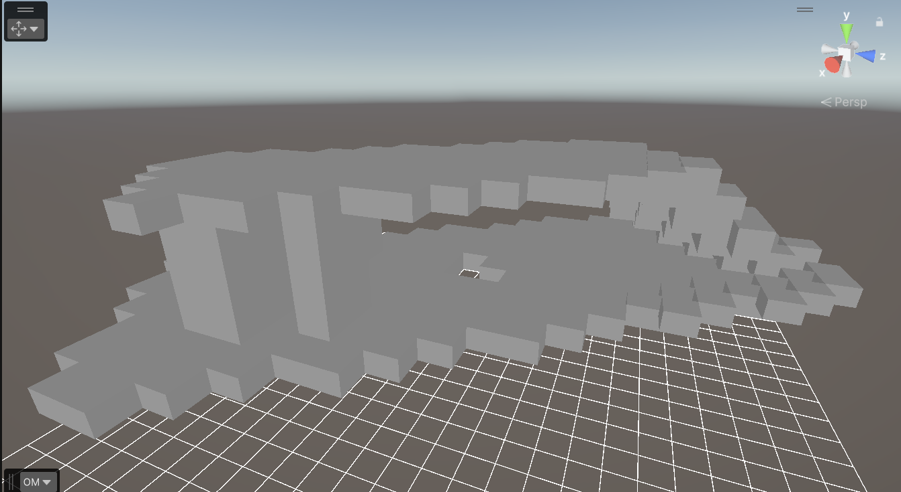 |
| With cell size of 0.5 | 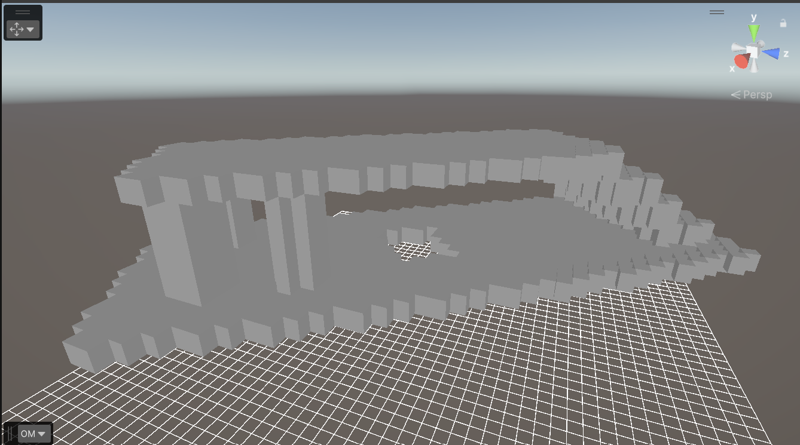 |
| With cell size of 0.25 | 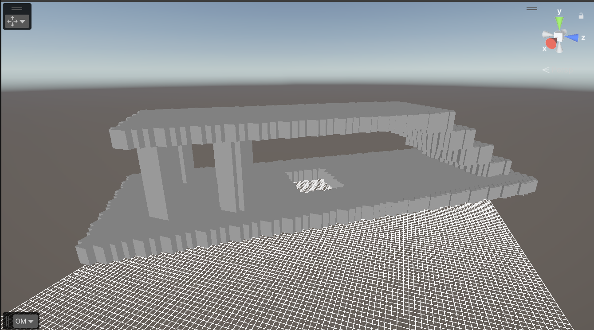 |
| With cell size of 0.1 | 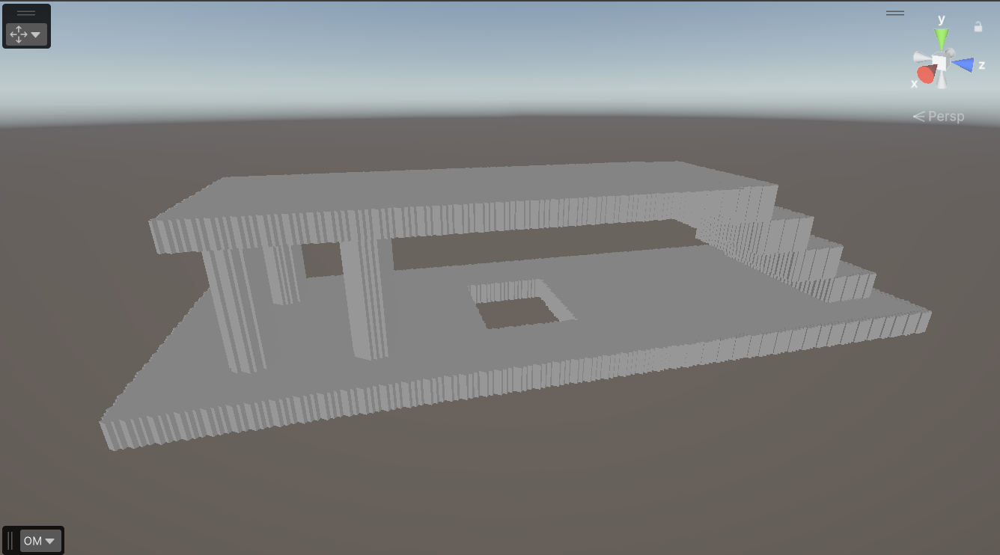 |

I then added skipping for spans completely out of the field's extents, and clamping for those extending sligthly beyond the bounds.

Without skipping or clamping:

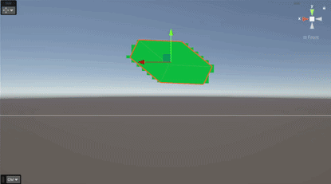

With skipping:

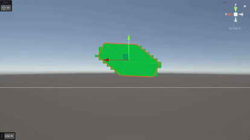

With skipping and clamping:

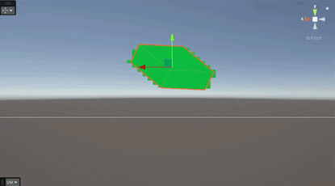

## Bibliography

Sutherland-Hodgman polygon clipping algorithm: https://www.youtube.com/watch?v=Euuw72Ymu0M
