#  AriadneNavMesh
This is a personal project aiming to implement the first steps of navmesh generation (geometry input, triangle voxelization and walkable filtering) in Unity. My main reference is [Recast Navigation](https://github.com/recastnavigation/recastnavigation).

## Geometry input

Started with a GeometryGetter class to see how I could retrieve scene geometry in Unity. I used the mesh filter component, so for now it takes only render meshes into account (might add option for physics colliders later).

## Triangle voxelization

### Heightfield

THE key element of navmesh generation is the heightfield. The heightfield is delimited by a bounding box, and its floor is a X-Z grid. Its used to voxelize triangles and get their spans (y-extent across a cell of the X-Z grid). I started with a centered grid, but I later moved-on to a grid starting at the bounding box minimun X and Z, for more convenient coordinates.

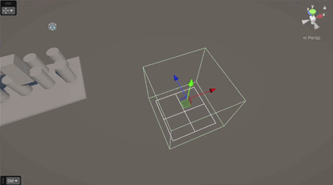

### Mapping

I then worked on mapping a single triangle to the heightfield's grid. It was pretty straightforward: we take the triangle's bounding box and map its X and Z coordinates to the grid's cells.

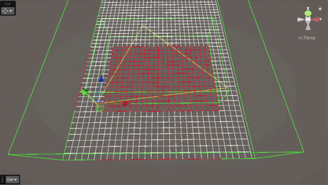

### Clipping
I then worked on clipping the polygon to each cell of the grid using Sutherland-Hodgman clipping algorithm. We start by clipping the polygon by an axis. We iterate over each segments of the polygon and compare them to a side of the current cell (our axis):
- if both points are inside of the cell, we save them both to the new polygon
- if both points are outside, we save neither
- if one of the point is inside and the other outside, we save the one inside and we save the intersection point between the cell's side and the current segment.

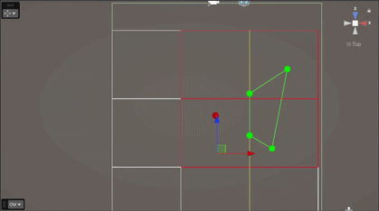

Once this is done, we repeat the operation for the 3 other sides of the cell, and we obtain the new polygon clipped to the cell. (here the triangle is clipped according to the bottom-leftmost cell)

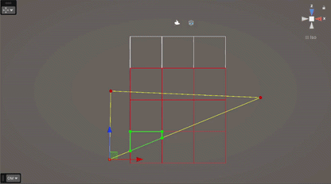

We then repeat the operation for every cell the triangle was mapped to.

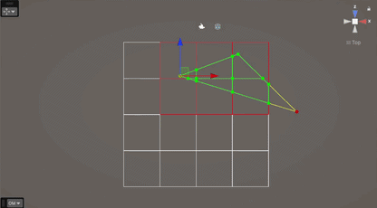
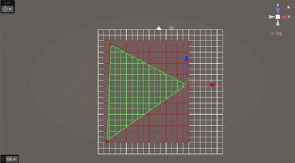

### Spans

Once we have a polygon for each cell, we get its lowest and highest points to register them as a span (Y-extent) in the heightfield.

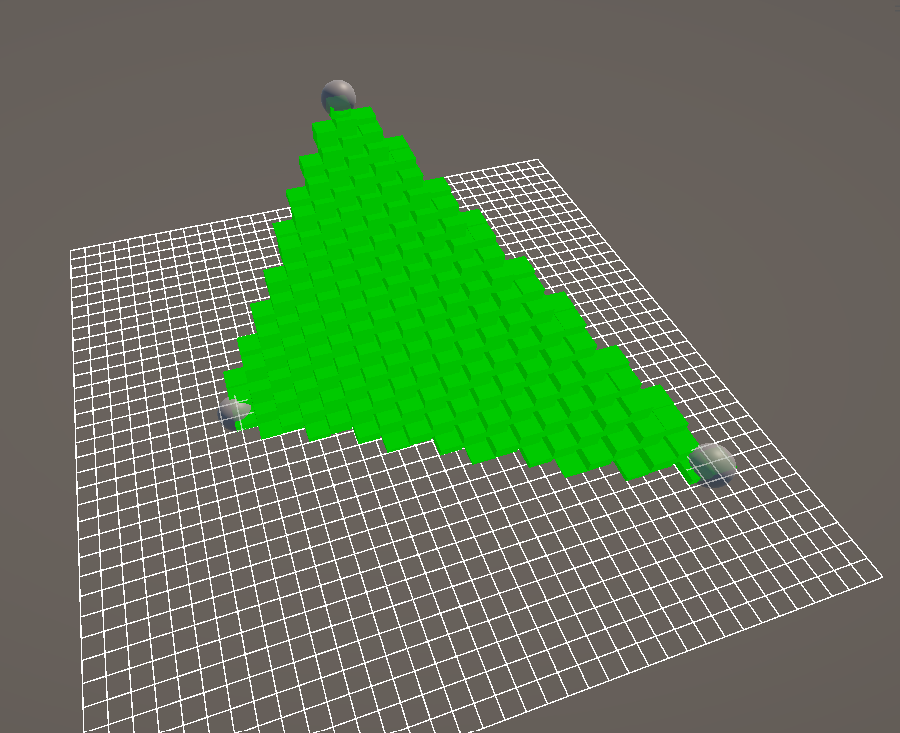

Once the pipeline working for one triangle, I fed the geometry getter's triangles to the heightfield, which led to whole meshes rasterization.

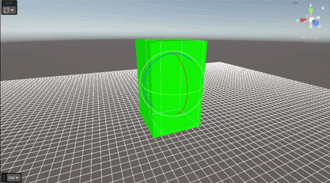

I then had to add proper spans management with multiple spans and spans merging, to be able to have clear spans between different objects. Without this logic:

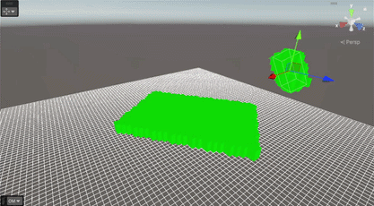

Once I implemented this, I experimented with different grid resolutions.

| Cell size | Result |
| :---: | :---: |
| With cell size of 1 | 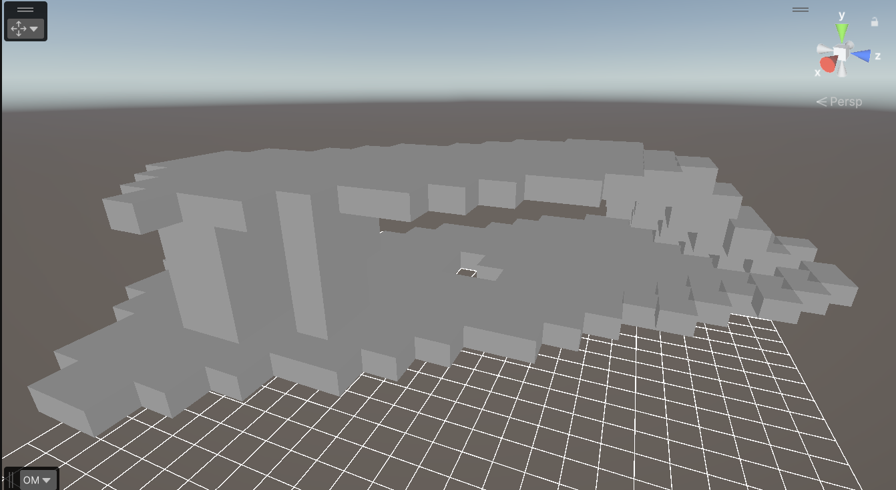 |
| With cell size of 0.5 | 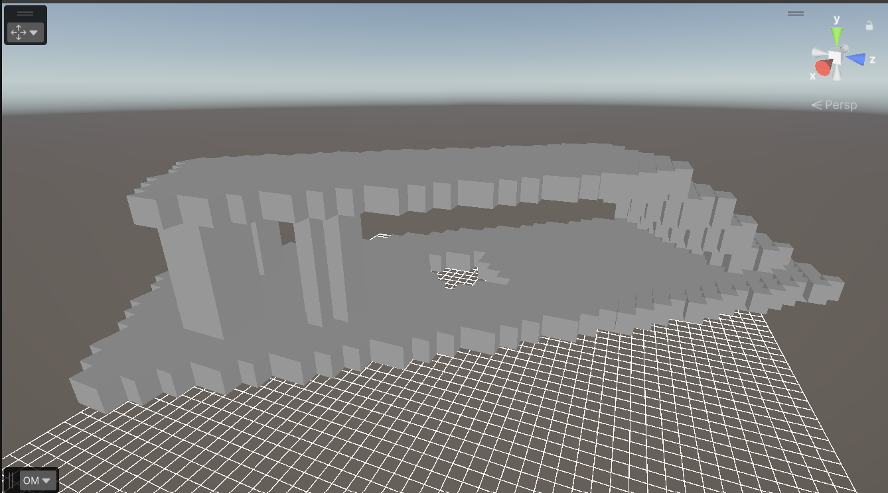 |
| With cell size of 0.25 | 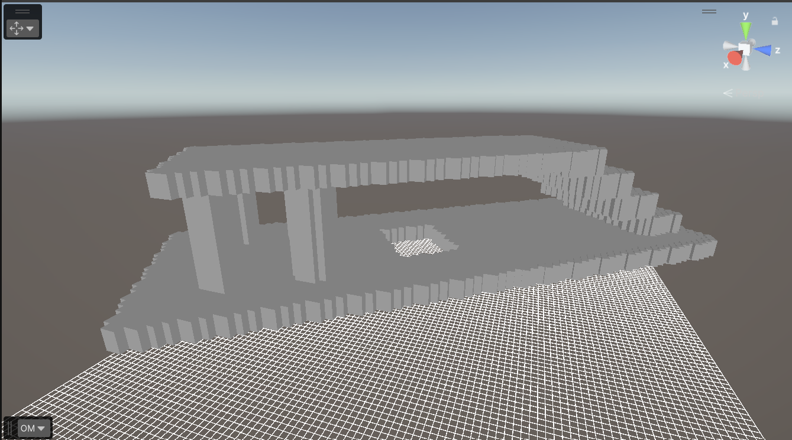 |
| With cell size of 0.1 | 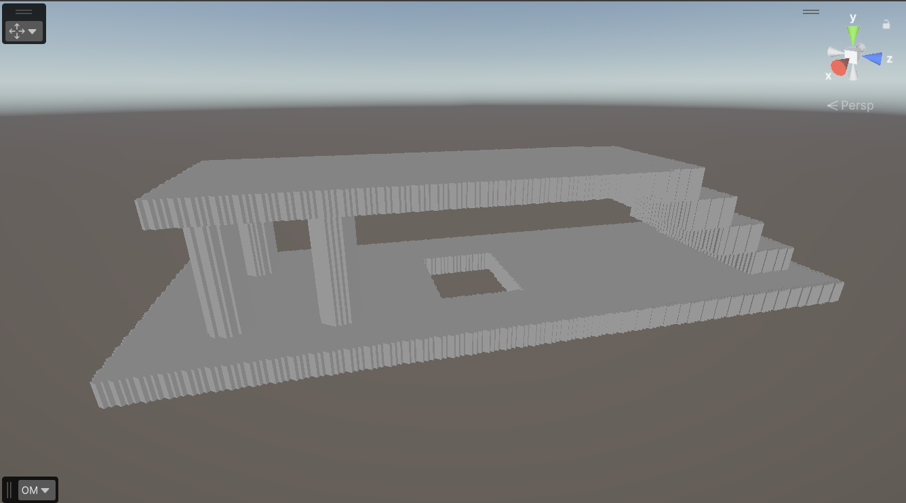 |

I then added skipping for spans completely out of the field's extents, and clamping for those extending sligthly beyond the bounds.

Without skipping or clamping:

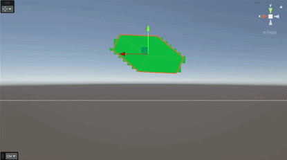

With skipping:

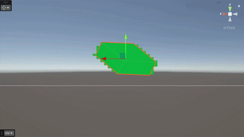

With skipping and clamping:

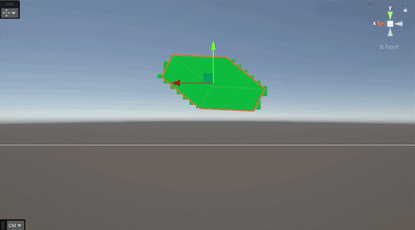

I then realized Recast actually uses discretized spans, so I switched from continuous (float) to discretized (int) spans with a cell height parameter.

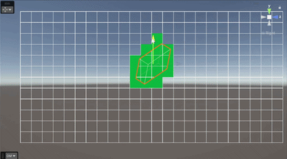

## Walkable filtering

I then moved on to walkable filtering, meaning tagging spans as walkable or not walkable based on multiple parameters (slope, climbable height and walkable height).

### Geometry input

The first step was to add normals to triangles in the geometry getter, and tag the triangle as walkable or not walkable depending on the walkable slope (normal's angle). 

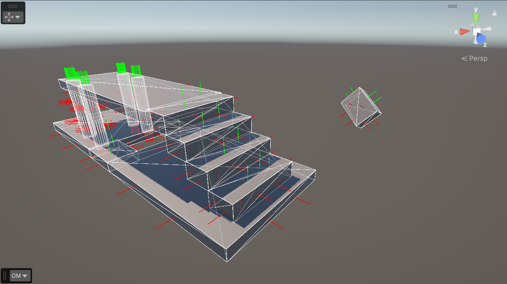

### Spans

The triangle's tag get carried over to the span. 

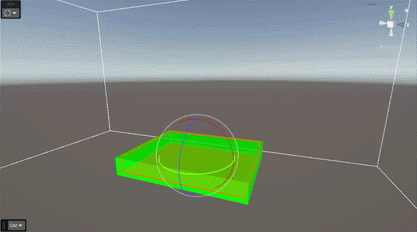

However, I had to add some merging logic:
- when the two span's top are near enough to each other (climbable height), we take the max area tag (walkable > not walkable)
- else we use the topmost span's tag

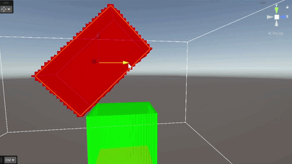

Once we have our merged spans, we move on to apply 3 filters.

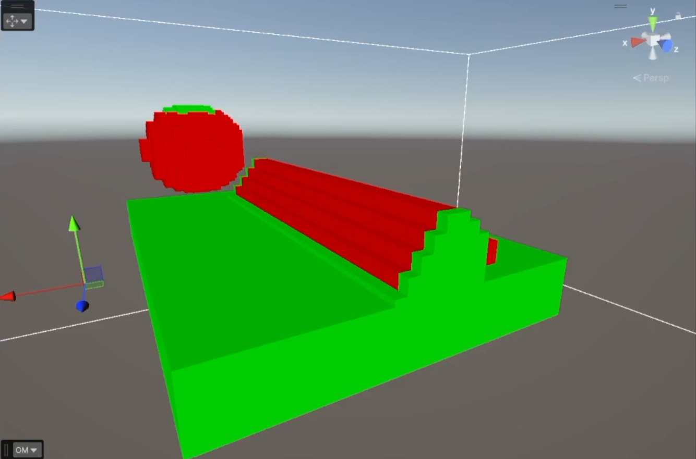

### Low hanging filter

The first one is used to tag as walkable low hanging unwalkable spans (<= climbable height) sitting on top of walkable spans.

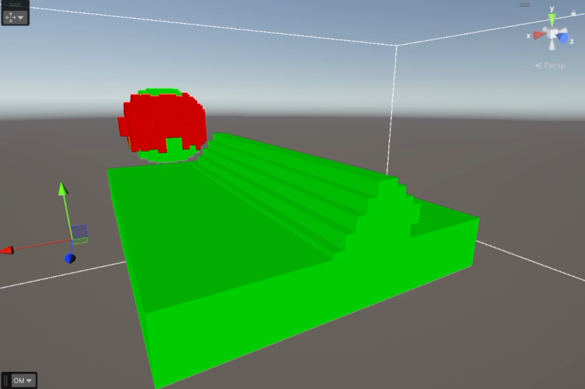

### Ledges filter

The second one is the most technical, it's used to tag as unwalkable all spans sitting at the edges or near large terrain variations.

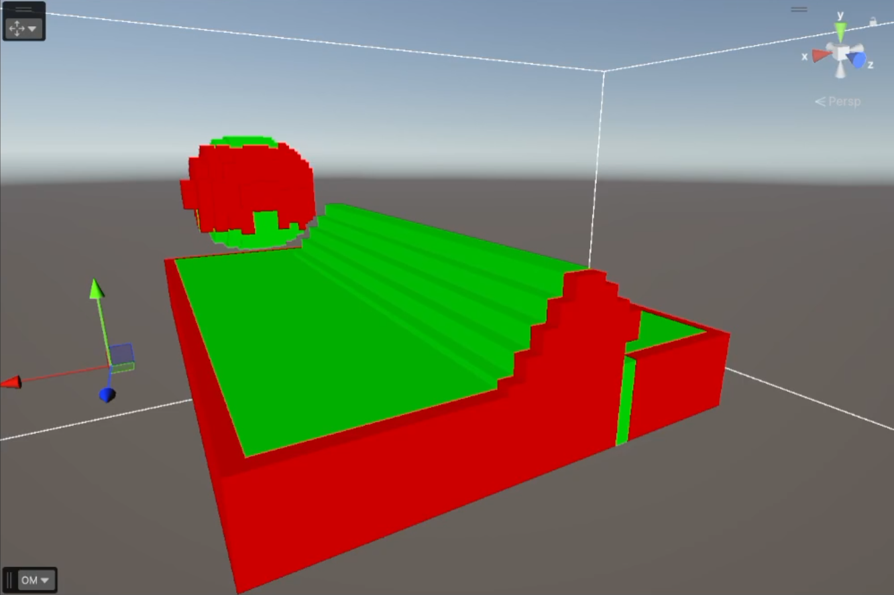

### Low height filter

The last one is used to tag as unwalkable spans which don't have enough headspace for an agent to go under (< walkable height).

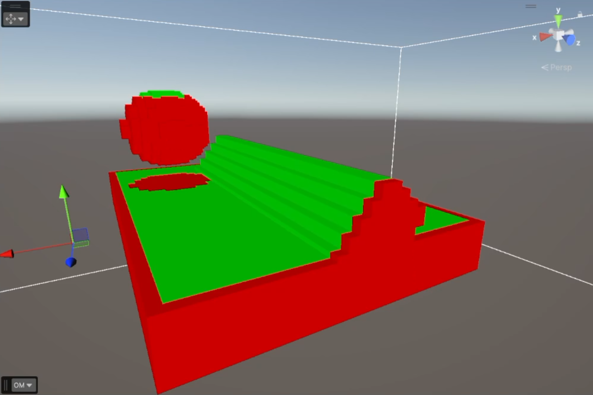

## Optimization

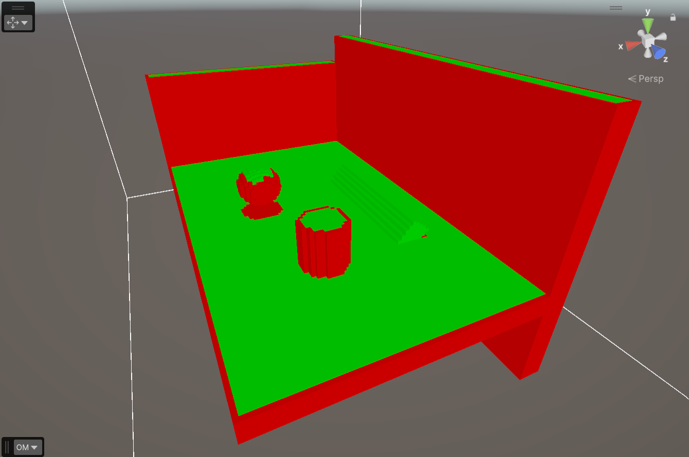

Benchmark for this scene, which has 700 vertices and 900 triangles fed into an heightfield of 36 000 cells with cell size = 0.1 and cell height = 0.025:

### Before
- Geometry input: ~0.75ms - 0.80ms
- Voxelization: ~210ms - 245ms
- Walkable filtering: ~8ms - 10ms

<b>Total: ~219ms - 256ms</b>

Lots of room for optimization. As we can see, the bottleneck is triangle voxelization.

### After 
- Geometry input: ~0.15ms (5x faster, -80%)
- Voxelization: ~11.5ms (18x faster, -94.5%)
- Walkable filtering: ~3.5ms (2.2x faster, -55%) 

<b>Total: ~15ms (14x faster, -93%)</b>

### Geometry input

1) After a pass on simplifying math and Triangle struct (moving from List to 3 variables): ~0.4ms 

2) After a pass focused on hoisting: ~0.15ms

### Voxelization

1) After a basic pass (math simplifications): ~160ms - 190ms

2) After a pass on memory allocations, moving the load from heap to stack using C# Spans instead of Lists: ~54ms - 74ms

3) After a pass aimed at maths (removing dot products thanks to X-Z scalar comparisons):
~25ms - 35ms

4) After a pass aimed at structure, reducing clipping work by two by reusing previous clipped polygon for the next row/cell: ~18ms

5) After a pass aimed at spans (AddSpan and moving from class to struct) and ClipPolygon (skipped empty bounding box cells): ~11.5ms

### Walkable filtering

1) After a pass on caching variables and removing useless allocations: ~5ms
2) After a pass aimed at spans (AddSpan and moving from class to struct): ~3.5ms

## Result

The full pipeline at the moment: 
- Geometry input 
- Voxelization 
- Walkable filtering 

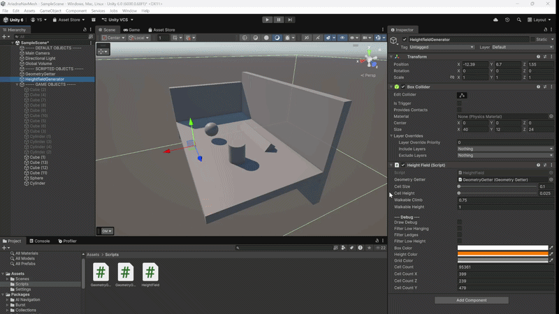

## Roadmap

Next steps would be:
- Region partitioning
- Contour extraction
- Polygon mesh generation

## Bibliography

- Recast repository: https://github.com/recastnavigation/recastnavigation
- Sutherland-Hodgman polygon clipping algorithm: https://www.youtube.com/watch?v=Euuw72Ymu0M
